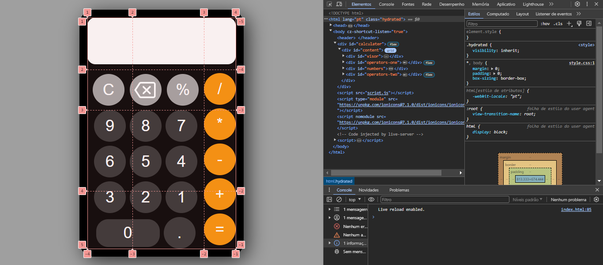

# Calculadora
Projeto de uma calculadora desenvolvida com HTML+CSS+JS

## Tecnologias usadas 

 
  
  
  

Observações e anotações: 
 
>No javascript utilizei funções que antes eu não tinha conhecimento

+ eval() computa um código JavaScript representado como uma string.

+